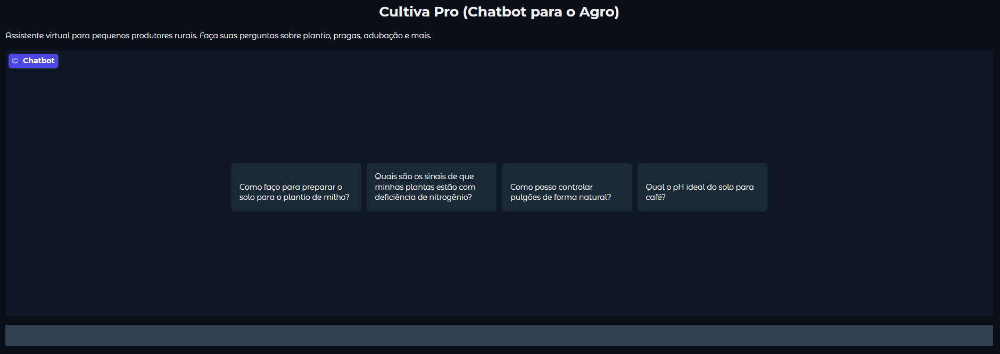

# Cultiva-PRO
Chatbot para produtores rurais utilizando Google Gemini e Gradio, desenvolvido em Python.
Este projeto foi resultado da participação da imersão da Alura com o Google.

Link: https://c5ec38a044869c0a13.gradio.live/

# Chatbot Agro IA com Gemini e Gradio

Este é um chatbot de assistência para pequenos produtores rurais, construído com Python, a API Google Gemini e a interface Gradio.

## Descrição

O chatbot é capaz de responder a perguntas comuns sobre:
- Plantio (geral)
- Pragas e doenças (identificação básica e controle inicial)
- Adubação (conceitos básicos)
- Coleta de amostras (solo, folha - princípios gerais)
- Interpretação básica de laudos simples (pH, N, P, K).

## Como Usar

1.  **Clone ou Baixe este Repositório (ou apenas o arquivo .ipynb).**

2.  **Requisitos/Dependências:**
            As bibliotecas Python necessárias estão listadas no arquivo `requirements.txt`. Instale-as usando pip:
            ```bash
            pip install -r requirements.txt
            ```

3.  **Configuração da Chave de API do Google Gemini:**
    * **IMPORTANTE:** Este projeto requer uma chave de API do Google Gemini.
    * **Se estiver rodando no Google Colab:**
        1.  Obtenha sua chave de API no [Google AI Studio](https://aistudio.google.com/app/apikey).
        2.  No Colab, clique no ícone de chave (Secrets) no menu à esquerda.
        3.  Adicione um novo secret com o nome `GOOGLE_API_KEY` e cole sua chave no campo "Value".
        4.  Certifique-se de que "Notebook access" está habilitado para este secret.
    * **Se estiver rodando localmente (fora do Colab):**
            O notebook foi adaptado para tentar carregar a API Key da variável de ambiente `GOOGLE_API_KEY` se não estiver rodando no Colab ou se a chave não for encontrada nos Secrets do Colab.
            Antes de executar o notebook localmente, você precisa definir esta variável de ambiente no seu terminal:

            Para Linux/macOS:
            ```bash
            export GOOGLE_API_KEY="SUA_CHAVE_API_AQUI"
            ```
            Para Windows (Command Prompt):
            ```bash
            set GOOGLE_API_KEY=SUA_CHAVE_API_AQUI
            ```
            Para Windows (PowerShell):
            ```bash
            $env:GOOGLE_API_KEY="SUA_CHAVE_API_AQUI"
            ```
            Lembre-se de substituir `"SUA_CHAVE_API_AQUI"` ou `SUA_CHAVE_API_AQUI` pela sua chave real. Não coloque sua chave diretamente no código! O notebook irá procurar por `GOOGLE_API_KEY`.

4.  **Executando o Chatbot (no Google Colab):**
    * Abra o arquivo Chatbot_Agro_IA.ipynb no Google Colab.
    * Execute a primeira célula para instalar as bibliotecas (se ainda não o fez no seu ambiente e estiver no Colab).
    * Execute a célula principal do código do chatbot.
    * Um link público do Gradio (terminado em `.gradio.live`) aparecerá no output da célula. Clique nele para abrir a interface do chatbot no seu navegador.

## Exemplo de Interface



## Licença
Apache License
Version 2.0

